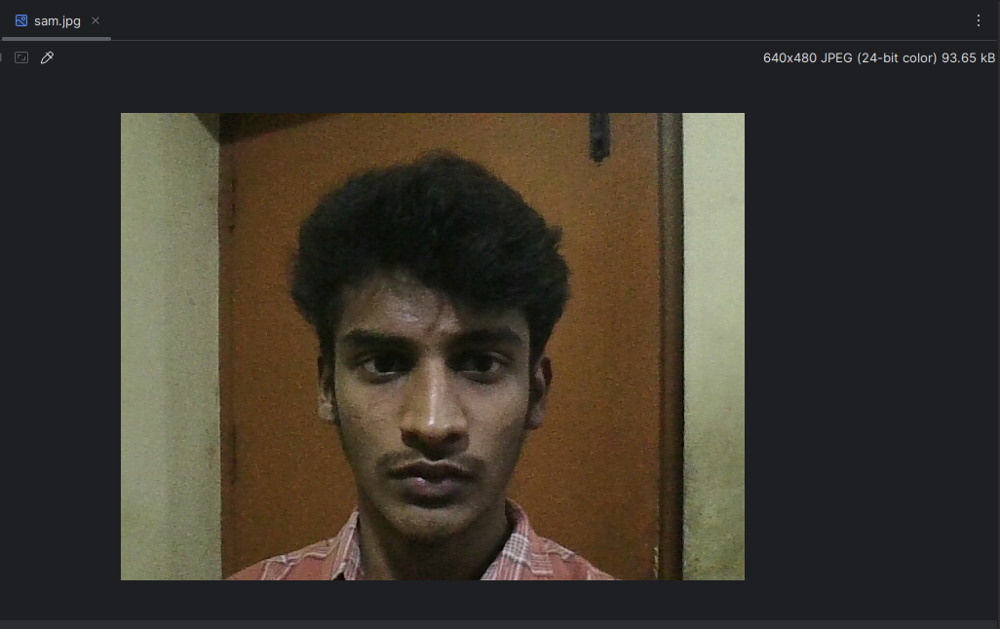
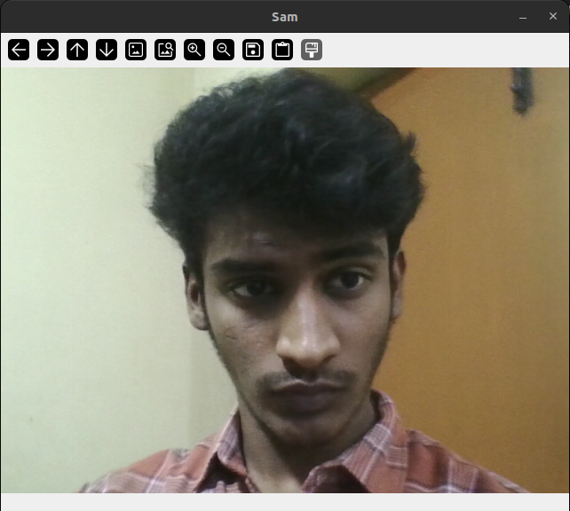
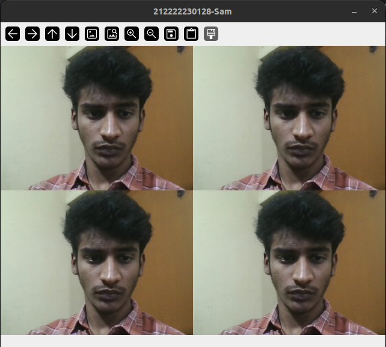
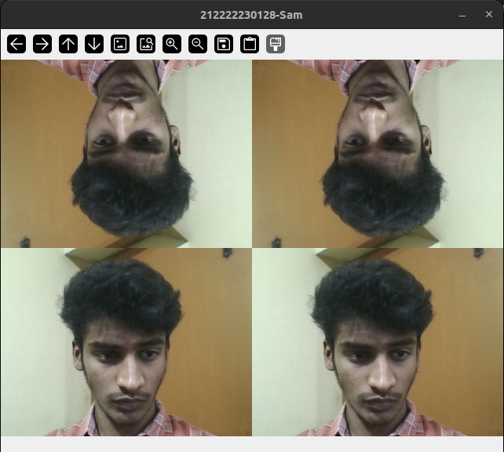

# Image_Acqusition-_using_Web_Camera
## Aim
To write a python program using OpenCV to capture the image from the web camera and do the following image manipulations.

i) Write the frame as JPG 

ii) Display the video 

iii) Display the video by resizing the window

iv) Rotate and display the video

## Software Used
Anaconda - Python 3.7
## Algorithm
### Step 1:
Use cv2.VideoCapture(0) to access web camera

### Step 2:
Use cv2.imread to read the video or image

### Step 3:
Use cv2.imwrite to save the image


### Step 4:
Use cv2.imshow to show the video


### Step 5:
End the program and close the output video window by pressing 'q'.


## Program:
``` Python
### Developed By:Sam Israel
### Register No:212222230128
```
## i) Write the frame as JPG file
```python
import cv2
videoCaptureObject = cv2.VideoCapture(0)
ret, frame = videoCaptureObject.read()
if ret:
    cv2.imwrite("sam.jpg", frame)
videoCaptureObject.release()
cv2.destroyAllWindows()
```
# ii) Display the video
```python
import numpy as np
import cv2
cap=cv2.VideoCapture(0)
while True:
    ret,frame=cap.read()
    cv2.imshow('Sam',frame)
    if cv2.waitKey(1)==ord('q'):
        break
cap.release()
cv2.destroyAllWindows()
```
## iii) Display the video by resizing the window
```python
import numpy as np
import cv2
cap=cv2.VideoCapture(0)
while True:
    ret,frame=cap.read()
    width=int(cap.get(3))
    height=int(cap.get(4))
    image=np.zeros(frame.shape,np.uint8)
    smaller_frame=cv2.resize(frame,(0,0),fx=0.5,fy=0.5)
    image[:height//2, :width//2]=smaller_frame
    image[height//2:, :width//2]=smaller_frame
    image[:height//2, width//2:]=smaller_frame
    image[height//2:, width//2:]=smaller_frame
    cv2.imshow('212222230128-Sam',image)
    if cv2.waitKey(1)==ord('q'):
        break
cap.release()
cv2.destroyAllWindows()
```
## iv) Rotate and display the video
```python
import numpy as np
import cv2
cap=cv2.VideoCapture(0)
while True:
    ret,frame=cap.read()
    width=int(cap.get(3))
    height=int(cap.get(4))
    image=np.zeros(frame.shape,np.uint8)
    smaller_frame=cv2.resize(frame,(0,0),fx=0.5,fy=0.5)
    image[:height//2, :width//2]=cv2.rotate(smaller_frame,cv2.ROTATE_180)
    image[height//2:, :width//2]=smaller_frame
    image[:height//2, width//2:]=cv2.rotate(smaller_frame,cv2.ROTATE_180)
    image[height//2:, width//2:]=smaller_frame
    cv2.imshow('212222230128-Sam',image)
    if cv2.waitKey(1)==ord('q'):
        break
cap.release()
cv2.destroyAllWindows()
```

## Output

### i) Write the frame as JPG image



### ii) Display the video



### iii) Display the video by resizing the window



### iv) Rotate and display the video



## Result:
Thus the image accessed from webcamera is displayed successfully using openCV.
